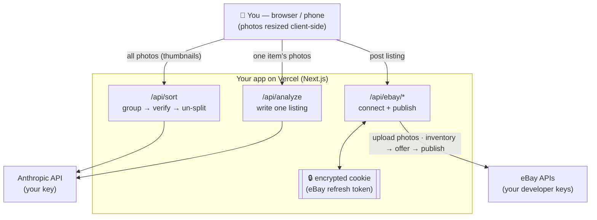

# Listing Writer 🪄

A free, open-source web app for resellers. **Dump in a pile of item photos →
it sorts them into separate items → writes a full eBay listing for each →
posts them to eBay.** Runs as your own private website on Vercel; works on your
computer and your phone.

It's **bring-your-own-keys**: you plug in your own Anthropic (AI) key and your
own eBay developer keys, so you're in full control and there's no middleman.

---

## What it does

- 📸 Upload a whole batch of photos at once
- 🏷️ **Split items by QR label** — shoot each item, then a QR code holding its
  inventory number, and the batch is cut at the labels with zero guessing
- 🔀 Or auto-sort with AI when your photos have no labels (group → verify → un-split)
- 🤖 Writes a title, description, item specifics, condition, and suggested price
- 🔍 **Accuracy check** — re-reads the photos and grades every claim as
  supported, not visible, or contradicted, so an invented brand or an
  unmentioned flaw never reaches a buyer
- 👁 **eBay preview** — see the listing as it will actually appear, built from
  the exact payload that publishes
- ✍️ Everything is editable before you post
- 🔢 **Multiples** — tick a box for quantity and an optional multi-buy discount;
  everything else stays one-of-a-kind by default
- 🚀 Posts straight to eBay — one item or the whole batch
- 📋 Or export everything as CSV / JSON
- 🔒 Your keys live in environment variables, never in the code

---

## Bulk listing with QR labels

The fastest, most reliable way to work a big pile of inventory.

**1. Print a QR label per item.** Encode whatever inventory number you already
use. All of these work:

| What you encode | Example |
|---|---|
| The code itself | `K75-A` |
| A URL with the code in a query parameter | `https://bins.example/scan?sku=K75-A` |
| A URL ending in the code | `https://bins.example/item/K75-A` |
| A small JSON blob | `{"sku":"K75-A"}` |

**2. Photograph in order: item, item, item, *label*.** The label is the
delimiter — everything shot before it belongs to that item. If your workflow
scans the label *first* instead, that's supported too.

**3. Drop the whole batch in.** Each photo is scanned for a QR code in your
browser as it's imported (nothing is uploaded to do this). Labelled photos get a
gold outline and show their code.

**4. Hit "Split into N items by label".** No model call, no sorting cost, no
review pass — each item arrives already carrying the inventory number that's
physically on it, which becomes its eBay SKU.

Edge cases are reported, never silently swallowed: photos trailing the last
label become an item that's flagged for review, a label with nothing before it
is skipped with a warning, and a duplicate inventory number is renumbered
(`K75-A` → `K75-A-2`) so eBay doesn't reject the second listing.

---

## Making sure the AI is telling the truth

Every listing gets an **accuracy check** with two independent layers:

- **Rules** run automatically as soon as a listing exists, and again on every
  edit. They catch contradictions *inside* the listing: a title over eBay's 80
  characters, a "new with tags" grade whose own notes mention a stain, apparel
  with no size, a price that's 3× the median of the live comps, item specifics
  that appear nowhere else in the listing.
- **The photo check** is a second model pass that re-reads the photos and grades
  each claim as **supported** (it can point at a readable label), **not visible**
  (plausible but unphotographed — the default when unsure), or **contradicted**
  (a photo shows something incompatible). Recognising a shape is explicitly *not*
  treated as evidence of a brand; only a readable tag, stamp, or engraving is.

A contradiction blocks the item from **Post all** — it can still be posted
individually, from a button that says exactly what you're overriding. Editing a
field invalidates only that field's photo verdict, so fixing a price doesn't
throw away (and make you pay again for) the brand check.

---

## Who can reach your deployment

With `APP_SECRET` set, **the whole app is private** — middleware checks a signed
session cookie before anything renders, so someone who finds the URL gets a login
screen that names neither the app nor your eBay account. That covers the page
itself and every API route.

Three paths stay deliberately public, because gating them breaks eBay:

| Path | Why it must stay open |
|---|---|
| `/api/ebay/callback` | eBay redirects your **browser** here after you consent. That request cannot carry an access code. It's protected instead by the OAuth `state` cookie. |
| `/privacy` | eBay requires a publicly reachable privacy-policy URL for your RuName. Gating it puts your keyset out of compliance. |
| `/login`, `/api/login`, `/api/logout` | The gate itself, and the ability to sign out of an already-expired session. |

**What a stranger with the URL can do:** see a login screen. Nothing else.

**What someone with the URL *and* your access code can do:** spend your Anthropic
credits, and list to *their own* eBay account through your developer keyset. They
**cannot** touch your eBay listings — your eBay refresh token lives in an
encrypted, httpOnly cookie in your browser only, and is never on the server. Treat
the access code as the thing that protects your Anthropic bill and your keyset's
standing, not your seller account.

Wrong codes are budgeted separately from ordinary traffic: **8 failures per IP per
15 minutes**, then that IP is refused even if it later supplies the right code. A
successful login clears the counter, so ordinary typos don't accumulate.

Rotating `APP_SECRET` invalidates every outstanding session immediately — the
cookie is signed with it — so that's your "log every device out" button.

---

## Multiples of the same item

Most of what goes through this app is one-of-a-kind, so **every listing defaults
to a single item** and the quantity field isn't even shown. When you do have
several of something, tick **"I have multiples of this item"** on its card and
set a quantity.

Nothing infers this from your photos. Whether you have five of something is a
fact about your shelf, not about the picture, and a quantity guessed from pixels
would oversell stock that isn't there.

Ticking the box also lifts eBay's one-per-buyer cap on that listing. That cap is
correct for a unique item and quietly wrong for everything else — left on, a
buyer literally cannot take a second unit.

### Multi-buy discount

Optional, alongside the quantity: *save X% each when buying N or more*. The card
shows what it costs you before you commit — at $24 with 15% off from 3, a buyer
taking three pays $20.40 each and you clear $61.20 in one sale.

Two things worth knowing about how eBay models this:

- A multi-buy discount isn't a property of a listing, it's an account-level
  **promotion** holding a set of listings. So listings sharing the same terms
  join **one** promotion rather than each creating their own — otherwise a
  200-item batch would leave you with 200 near-identical promotions and then
  start failing at eBay's cap.
- It needs the `sell.marketing` permission, which connections made before this
  feature existed don't have. **If your eBay connection is older, disconnect and
  reconnect once.** Posting tells you if that's needed; the listing itself
  publishes either way, and only the discount is skipped.

The discount is applied *after* the listing goes live and can never fail the
listing. ⚠️ It is also the one part of the publish pipeline not yet exercised
against a live eBay account — it's written from eBay's Marketing API docs, so
check the first one lands in eBay's Promotions manager.

---

## Shipping: weight, box, and cost per item

Every drafted listing gets a **📦 Shipping** panel. The model estimates the
item's own weight and dimensions from the photos — reading a figure printed on
the box or spec plate where there is one — and the app does the rest:

- picks the smallest box that fits with padding, from ~160 standard corrugated
  sizes, and prices a **cut-to-fit** carton alongside it when cutting one down
  would be cheaper
- prices **poly mailers** too, which for soft goods are usually the cheapest
  thing on the list by a wide margin
- prices **every USPS flat-rate container the item fits** — the three flat-rate
  envelopes (plain, legal, padded) and the five flat-rate boxes
- adds the box's own weight and packing fill
- computes **dimensional weight**, which is what carriers actually bill on once
  a package passes one cubic foot
- prices Ground Advantage, Priority, and Priority Flat Rate, and recommends the
  cheapest
- shows what you'd **net at your asking price with free shipping**, after
  postage and eBay's fee

Every field is editable, recalculates live, and — the part that matters — is
what actually publishes. A per-item figure you type in beats the
`EBAY_DEFAULT_PACKAGE_*` env override and the item-class profile, in that order.

Anything the photos didn't show is filled in from a category profile, and the
panel **shows you that figure** greyed in the field with an `assumed` tag rather
than leaving the box empty. An empty box that silently stands for 11 inches is
how an edit ends up appearing to do nothing: you correct one dimension, the
other two are still guesses, and the quote doesn't move.

Where the box is over a cubic foot, volume rather than the scale sets the price,
and the panel says so explicitly — including the weight you'd have to pass
before weight starts mattering again.

### Why the box catalogue is dense

A wrong box is expensive, and the expense is silent. Carriers bill on volume once
a package passes a cubic foot, so the gap between one stock size and the next is
paid for in cash by whoever ships the item that falls between them.

An 8 oz item measuring 10×12×4 — an ordinary shape — had nothing between a
14×11×6 (too narrow) and a 16×12×8, and the 16×12×8 crosses a cubic foot: billed
at 169 oz of *volume* instead of its actual 23 oz, **$31.50 instead of $9.10**.
Editing the weight changed nothing, because weight was not what set the price. A
sweep of realistic item shapes found 560 landing in gaps like that.

Two changes close it:

- **~110 standard corrugated sizes** instead of 22, dense through the 12–16 inch
  band where most household goods land.
- **A cut-to-fit carton**, priced alongside the stock sizes whenever cutting one
  down would actually be cheaper — because no seller would pay $78 to ship a
  19×7×5 item in a 24×18×12 when a minute with a knife costs nothing. It's
  suppressed when it saves nothing, and never offered for something USPS wouldn't
  carry anyway (108″ longest side, 130″ length plus girth).

A test sweeps 1,912 item shapes and fails if *any* of them is billed on volume
when a snug box would have avoided it.

### Poly mailers

A bag has no volume of its own — it takes the shape of what's inside. That makes
it the right answer for exactly the items cartons handle worst: bulky, light, and
not fragile.

A folded wool coat measuring 14×11×4 needs an 18×14×6 carton, which crosses a
cubic foot and gets billed on 168 oz of volume: **$31.50**. The same coat in a
24×19 poly mailer is billed on its own volume, with no carton weight and no void
fill: **$11.40**.

Bags are modelled as bags, not as thin boxes. A mailer wraps, so what has to fit
its flat width is the item's width **plus** its height, not each of them
separately — and its dimensional weight comes from the item rather than from a
container several inches larger on every axis.

**A poly mailer is never recommended for something fragile.** It stays on the
list for every item, because you know what you're packing and the app doesn't,
but for anything outside the soft-goods categories the recommendation goes to a
box and the panel says what the bag would have saved.

### When size, not weight, sets the price

Past a cubic foot, USPS bills on volume. An 18×10×11 item is charged as 216–301 oz
whether it weighs 4 oz or 200 oz, so editing the weight moves nothing — correct
arithmetic that reads exactly like a broken input.

The panel now says so **directly under the weight field**, names the dimensional
weight, and states the packed weight you'd have to exceed before weight starts
mattering again. It used to say this at the bottom of the panel, below the fold,
where nobody read it.

### Choosing the packaging yourself

The estimator recommends the cheapest option that fits, but **you can pick any of
them** from the radio list — the headline, packed weight, container size, margin
figures, and what gets sent to eBay all follow your choice, not the cheapest.

This matters most for flat rate, which ignores weight entirely up to 70 lb. A
40 oz camera lens costs **$9.90** in a Flat Rate Envelope against **$11.40**
weight-based; a 2 oz item in the same envelope would be paying roughly double for
nothing. Neither is knowable in advance, so both get priced and you decide.

Envelopes are not modelled as small boxes. A carton needs packing room on every
side; an envelope needs a little slack across the face and nothing at all through
the thickness, because that dimension is the flap closing. So the fit test uses a
clearance on two axes and a hard thickness ceiling on the third — ¾″ for the
plain and legal envelopes, 1″ for the padded one.

If you later correct a dimension so your chosen container no longer fits, the
selection is **dropped with a warning** rather than honoured. Publishing a
package the item demonstrably cannot go into is the one outcome worse than
silently reverting to the cheapest that works.

⚠️ **Flat rate is what *you* pay at the counter, not necessarily what the buyer
is charged.** What the buyer sees comes from your eBay shipping policy — if that
policy offers calculated shipping, eBay prices by weight and size regardless of
what you picked here. To charge the buyer a flat rate, either tick free shipping
and build the postage into your price, or use an eBay policy with a fixed
shipping cost. The panel says this on-screen whenever you select a flat-rate
option.

### Free shipping vs. buyer pays

A checkbox per listing, with **both** net figures shown side by side so the
choice is informed rather than a habit:

| | Net at $45 asking, $23 postage |
|---|---|
| Free shipping (you pay) | **$15.64** |
| Buyer pays shipping | **$35.59** |

The gap is bigger than the postage itself, and the reason is easy to miss: eBay
charges its final value fee on the **order total**, so when the buyer pays
shipping you're also charged a fee on that shipping — but you're not out the
postage. Free shipping does tend to convert better; this just makes the price of
that decision visible per item.

The checkbox isn't cosmetic. At publish time the app picks the eBay **business
policy** matching your choice, instead of always using whichever policy happens
to be first on your account. If your account has no policy of the requested
kind, the listing publishes under your default and **says so in a warning**
rather than quietly doing the opposite of what you asked.

### About the numbers

**The weight and box size are the reliable part, and they're what get sent to
eBay.** With calculated shipping, eBay quotes buyers from those figures at real
current rates — so getting them right is what stops you absorbing the
difference on every sale.

**The dollar amounts are an estimate from a built-in table**, not a live carrier
quote — this app has no USPS/UPS credentials and eBay exposes no public
rate-quote API. They're there for margin maths ("is this worth listing at all").
Check them against what you actually pay.

To correct them, edit `lib/shipping/rates.ts`, or set `SHIPPING_RATES_JSON` to a
JSON object of the same shape — no code change needed. A malformed override is
rejected and the built-in table is used instead, rather than silently pricing
everything at $0.

If the photos show nothing to judge weight from, the estimate falls back to a
per-category profile and **says so** — that's the amber panel. Weigh the item
before pricing off it.

---

## Seeing the listing before it goes live

**Preview as it will appear on eBay** renders the item page from the *same*
payload builder the publish route uses, driven by the *same* live eBay taxonomy
lookup. So the category is the leaf category eBay picked, the item specifics are
the ones eBay will store (canonicalised, cardinality-trimmed, numeric-sanitised),
and the condition line is the tier eBay will actually display — which is often
not the grade you chose, because eBay has no "Very Good" tier in fashion.

Two things a preview genuinely can't know, and which it says rather than guesses:
whether the SKU is already live on your account, and whether eBay's validators
will reject a particular specific value. Both are only answered on submission,
and the posting flow already recovers from them.

---

## What you'll need (all free to start)

1. **An Anthropic API key** — the AI that writes listings. Get one at
   <https://console.anthropic.com/> (you pay Anthropic per use; pennies per item).
2. **An eBay developer keyset** — to post listings. Free at
   <https://developer.ebay.com/>. You'll need the **App ID**, **Cert ID**, and a
   **RuName** (explained below). *Only needed for posting — sorting and writing
   work without it.*
3. **A Vercel account** — free hosting. <https://vercel.com/>
4. **Node.js** installed on your computer — <https://nodejs.org/> (the "LTS" version).

> There are two ways to set this up. **Not a coder? Use the Quick Start.**
> Comfortable in a terminal? Skip to *Setup for developers*.

---

## 🚀 Quick Start (no coding required)

You can get your own copy running without ever opening a terminal.

**1. Make your free accounts and grab your keys.**
   - Anthropic key at <https://console.anthropic.com/> → "API Keys" → create one (starts with `sk-ant-`).
   - eBay developer keyset at <https://developer.ebay.com/> (do this part later if you only want to write listings, not post them).
   - A Vercel account at <https://vercel.com/> — sign up **with GitHub** (it'll make a free GitHub account too if you don't have one).

**2. Deploy your own copy in a few clicks.**
   Click the button (it copies this project to your own GitHub and deploys it on Vercel):

   [](https://vercel.com/new/clone?repository-url=https://github.com/ashnicholes-droid/hahm-ebay-lister)

   Set **both** of these environment variables. Vercel sometimes asks for them
   during the deploy — but **its current flow often doesn't ask at all**. If you
   weren't prompted, deploy first, then add them under **your project →
   Settings → Environment Variables** and hit **Redeploy** (Deployments → ⋯ →
   Redeploy):
   - `ANTHROPIC_API_KEY` — your Anthropic key (starts with `sk-ant-`).
   - `APP_SECRET` — any access code you make up (a memorable phrase works). A
     deployed app **won't run without this**: it stops strangers from spending
     your Anthropic credits, and every AI action returns an error until it's set.

   (You can add the eBay variables later.) After deploying you'll get a web
   address like `https://your-app.vercel.app`.

**3. Bookmark your app** on your computer and add it to your phone's home
   screen. You can start sorting and writing listings immediately.

**4. To enable posting to eBay** (optional), follow *Set up eBay posting* below
   using your new web address, then add the eBay values in
   **Vercel → your project → Settings → Environment Variables** and redeploy.

That's it — no terminal, no code editing. Everything else below is for people
who want to run it locally or tinker.

---

## Setup for developers (command line)

### 1. Get the code
```bash
git clone https://github.com/ashnicholes-droid/hahm-ebay-lister.git
cd hahm-ebay-lister
npm install
```

### 2. Try it locally (optional)
Create a file called `.env.local` (copy from `.env.example`) and add at least
your Anthropic key:
```bash
cp .env.example .env.local
# then edit .env.local and set ANTHROPIC_API_KEY=sk-ant-...
npm run dev
```
Open <http://localhost:3000>. You can sort and write listings right away.
(eBay posting needs the eBay setup below + a deployed URL.)

### 3. Deploy to Vercel
The easiest path:
```bash
npm i -g vercel     # one time
vercel login        # one time
vercel --prod       # deploys; gives you a URL like https://your-app.vercel.app
```
Then add your environment variables in the Vercel dashboard
(**Project → Settings → Environment Variables**) — see the full list below —
and redeploy with `vercel --prod`.

> Prefer no terminal? You can also push this repo to GitHub and import it at
> vercel.com → "Add New Project", then add the env vars there.

### 4. Set up eBay posting (optional, for the "Post to eBay" button)
1. At <https://developer.ebay.com/> create a **Production keyset**. Note the
   **App ID (Client ID)** and **Cert ID (Client Secret)**.
2. Under that keyset → **User Tokens** → **Add eBay Redirect URL (RuName)**.
   Set, using your deployed URL:
   - **Auth accepted URL:** `https://your-app.vercel.app/api/ebay/callback`
   - **Auth declined URL:** `https://your-app.vercel.app/?ebay=declined`
   - **Privacy policy URL:** `https://your-app.vercel.app/privacy`
   - Choose **OAuth** (not Auth'n'Auth).
3. Copy the generated **RuName** — the short identifier (like `Name-XXXX-XXXX-XXXX`),
   **not** the long "eBay Production Sign In (OAuth)" URL shown on the same page.
4. Put all the values into Vercel's env vars (below) and redeploy.
5. On the live site, click **Connect eBay**, approve on eBay, and paste the URL
   from eBay's confirmation page back into the app. Done (lasts ~18 months).

> **"Marketplace account deletion" compliance.** When you create a production
> keyset, eBay flags it **"not compliant"** and asks for a *Marketplace account
> deletion/closure notification endpoint*. This app stores **no** eBay user data on
> a server — your token lives only in an encrypted cookie in your own browser — so
> you don't need an endpoint. Instead, take eBay's exemption: in the developer
> portal under *Alerts & Notifications → Marketplace account deletion*, toggle ON
> **Exempted from Marketplace Account Deletion / Not persisting eBay data** and
> submit it. (Describe your setup honestly — eBay penalizes false exemptions.) Do
> this **before** your first production API call. Only if eBay won't accept the
> exemption do you need to host an endpoint.

---

## Environment variables

| Variable | Required | What it is |
|---|---|---|
| `ANTHROPIC_API_KEY` | ✅ | Your Anthropic API key (writes the listings) |
| `APP_SECRET` | ✅ for deployed apps | Access code locking **the entire app** — the page and every API route, not just the AI ones. Someone with the URL and no code sees a login screen and nothing else. **A deployed (production) app fails closed without it.** Asked for once per device, then remembered for 30 days. Optional only for local dev. See *Who can reach your deployment* below. |
| `EBAY_CLIENT_ID` | for posting | eBay App ID |
| `EBAY_CLIENT_SECRET` | for posting | eBay Cert ID |
| `EBAY_RU_NAME` | for posting | Your eBay RuName — the short `Name-XXXX-XXXX-XXXX` identifier, **not** the long "Sign In (OAuth)" URL |
| `SESSION_SECRET` | for posting | Random string to encrypt your eBay token. Generate: `node -e "console.log(require('crypto').randomBytes(32).toString('hex'))"` |
| `APP_URL` | for posting | Your deployed URL, e.g. `https://your-app.vercel.app` |
| `EBAY_LOCATION_POSTAL_CODE` | optional | Your ZIP (only used once to create an eBay inventory location) |
| `EBAY_DEFAULT_PACKAGE_WEIGHT_OZ` | optional | Default package weight in ounces (16 = 1 lb) sent to eBay so **calculated-shipping** policies can publish (avoids eBay error 25020). Used when neither the photos nor the seller supplied a weight; overrides the built-in per-item-class defaults (coats, shoes, media, etc.). A weight typed into a listing's shipping panel outranks this. Editable per listing on eBay. |
| `EBAY_DEFAULT_PACKAGE_LENGTH_IN` / `_WIDTH_IN` / `_HEIGHT_IN` | optional | Default package dimensions in inches. Same precedence as the weight above: per-listing edits win, then these, then the per-item-class defaults. |
| `EBAY_STRICT_QUALITY` | optional | Set to `1` to **stop** a publish when eBay's item-specifics schema can't be retrieved, instead of publishing with a warning. |
| `PRICE_MARKUP_PERCENT` | optional | Storewide markup applied to every **auto-suggested** price (the AI estimate and the comps "use median" button) before you review it — for sellers who run a permanent store-level sale that discounts everything. `40` lists at 1.4×. The marked-up price is what you see on the card, and you can still edit it; manually typed prices are never touched. Note the math: +40% then a 40%-off sale nets 84% of the original — to land back on the suggested price after an X%-off sale, set `100·X/(100−X)` (≈`66.7` for 40% off). Unset = no markup. |
| `EBAY_MARKETPLACE_ID` / `EBAY_CATEGORY_TREE_ID` / `EBAY_CURRENCY` | optional, experimental | Marketplace override, e.g. `EBAY_GB` / `3` / `GBP` for eBay UK — set all three together. Defaults: `EBAY_US` / `0` / `USD`. ⚠️ **The US site is the only tested marketplace.** Known gaps on other sites: photo uploads still use the US site ID, condition-tier and size-standardization handling were validated against eBay US, and the UI shows prices with a `$` symbol. After changing marketplace, regenerate the offline category map: `npx tsx scripts/refresh-category-map.ts`. |

**Never commit real keys.** `.env.local` is gitignored; production keys live in
Vercel only.

---

## How it works (for the curious)



- **Frontend** (`app/`): the upload → split → review → write → check → post
  wizard. Photos are shrunk **and QR-scanned** in your browser before upload.
- **QR splitting** (`lib/qrGrouping.ts`): pure, deterministic, no network. This
  replaces `/api/sort` entirely when your photos carry labels.
- **`/api/sort`**: groups photos into items (AI), with verify + un-split passes.
- **`/api/analyze`**: writes a listing for one item from its photos.
- **`/api/verify`**: re-reads the photos and grades each claim in the drafted
  listing (see *Making sure the AI is telling the truth* above).
- **`/api/ebay/preview`**: builds the publish payload without sending it, so the
  preview can't drift from what actually posts.
- **`/api/ebay/*`**: OAuth connect (encrypted-cookie token) + the
  inventory→offer→publish flow, with recovery for eBay's category/aspect quirks.
- **Stack**: Next.js (App Router) + TypeScript, deployed on Vercel. Nothing is
  stored server-side; photos are used to build listings and discarded.

---

## Costs

- **Anthropic**: a few cents per item (sorting + writing). You set your own key.
- **eBay**: normal eBay selling fees apply to listings you post.
- **Vercel**: free Hobby tier is plenty for personal use.

---

## License

**Functional Source License (FSL-1.1-MIT)** — see [LICENSE](LICENSE).

In plain English: **free to use, modify, and self-host** — including for your
own reselling business. The one thing you *can't* do is sell this software or
offer it as a competing paid product/service. Two years after each release, that
restriction lifts and it becomes plain MIT. Use it, fork it, share it — just
don't resell it.
