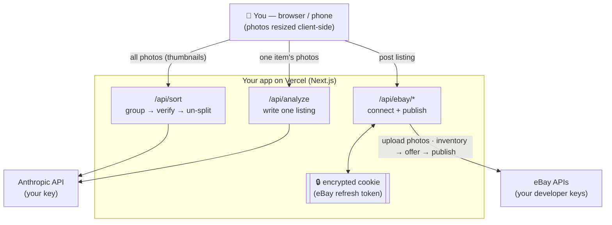

# Listing Writer 🪄

A free, open-source web app for resellers. **Dump in a pile of item photos →
it sorts them into separate items → writes a full eBay listing for each →
posts them to eBay.** Runs as your own private website on Vercel; works on your
computer and your phone.

It's **bring-your-own-keys**: you plug in your own Anthropic (AI) key and your
own eBay developer keys, so you're in full control and there's no middleman.

---

## What it does

- 🔦 **Scout before you buy** — point it at something in a shop and get the most
  you should pay, from live comps minus eBay's fee and postage
- 📸 Upload a whole batch of photos at once
- 🏷️ **Split items by QR label** — shoot each item, then a QR code holding its
  inventory number, and the batch is cut at the labels with zero guessing
- 🔀 Or auto-sort with AI when your photos have no labels (group → verify → un-split)
- 🤖 Writes a title, description, item specifics, condition, and suggested price
- 🔍 **Accuracy check** — re-reads the photos and grades every claim as
  supported, not visible, or contradicted, so an invented brand or an
  unmentioned flaw never reaches a buyer
- 👁 **eBay preview** — see the listing as it will actually appear, built from
  the exact payload that publishes
- 🔎 **Wrong item? Retitle and re-research** — correct the name and the
  description, specifics and price are rebuilt around it
- ✍️ Everything is editable before you post
- 🔢 **Multiples** — tick a box for quantity and an optional multi-buy discount;
  everything else stays one-of-a-kind by default
- 🚀 Posts straight to eBay — one item or the whole batch
- 💲 **Market-based pricing** — comps compared on delivered price (item +
  postage), suggestions anchored near the bottom of the market with a margin you
  set, and a popup listing every comp so you can check them
- 🏷️ **Seller view** — see every live listing with watchers/views, change prices
  (the only way to edit listings this app posted), rewrite titles and
  descriptions in place, record what you paid, send offers to watchers, and end
  or relist dead stock
- 💵 **What sold** — completed sales with eBay's *actual* per-order fee rather
  than an estimate of it, realized profit against what you paid, a check on
  whether the app's fee model matches your real invoices, and tracking upload
  without a trip to Seller Hub
- 📋 Or export everything as CSV / JSON
- 🔒 Your keys live in environment variables, never in the code

---

## Scout: should you buy it?

Everything else in this app starts once the item is already yours. But the
decision that decides whether a reselling month is profitable happens earlier and
faster — standing in a thrift store with a $6 sticker in your hand and about
fifteen seconds to make up your mind.

**`/scout` runs the app's own maths backwards.** Instead of "what should I charge
for this?", it answers "what can I pay?"

Photograph the item (or just type what it is) and it comes back with:

> **PAY UP TO $4.52**
>
> Based on 14 live listings ($30.00–$70.00 delivered). Planned on the cheap end,
> since those are asking prices and the cheapest listings are the ones that
> actually sell.

Type the sticker price and the verdict resolves live:

| Sticker | Verdict | Why |
|---|---|---|
| $4 | **BUY** | $12.52 profit · 313% return — clears both your rules |
| $12 | **YOUR CALL** | $4.52 profit — under your $10 minimum and your 100% return rule |
| $40 | **SKIP** | You'd lose $23.48. Worth it under $4.52 |

The max-buy price is the useful one, and it's useful *before* you look at the
sticker: it turns "is this worth $6?" into "check whether it's under $4.52."

### It is allowed to say it doesn't know

Under three comparable listings, **no verdict is offered at all** — not a
cautious one, none:

> **CAN'T TELL** · Only 2 comparable listings — too few to judge. Trust your own
> knowledge here.

This is the same rule the Sold screen follows, and it matters more here than
anywhere else in the app: a confident wrong answer is spent on an item you cannot
return. The screen also distinguishes "can't tell" from **ADD PRICE**, which
looks similar and means the opposite — the app knows exactly what the item is
worth and is waiting on you.

### Asking prices are not sale prices

eBay retired `findCompletedItems` in February 2025 and Marketplace Insights (real
sold data) is a closed Limited Release, so **active listings are all this app can
see** — and active listings skew high, because the ones priced right already sold
and left. Scout corrects for that, but only **once**:

- **Low end** (default) — plans on the 10th percentile of the asking band. The
  cheapest active listings are the ones about to sell, so the correction is
  already baked in.
- **Middle** — plans on the median with a 12% discount applied.

An early build did both, and planned on $26.40 against a band whose cheapest comp
was $30 — below every listing in the set, turning a good $4 buy into "your call".
Conservative is the point; impossible isn't.

### Your rules, not mine

Under **⚙ Rules**: minimum profit (default $10), minimum return (default 100% —
doubling your money), and which end of the band to plan on. They're saved on the
device. Which rule binds flips with price — on a cheap item the flat minimum is
the ceiling, on an expensive one the ratio is — which is why there are two.

### Built for an aisle, not a desk

- Two taps to an answer, and the verdict is above the fold on a phone.
- One round trip: identify, comps and postage come back together, because shop
  wifi gives you one chance.
- A **fast model and a narrow prompt** — this doesn't write a description or item
  specifics, so it answers in seconds rather than the 20–40 the full listing pass
  takes.
- Wrong identification? Retype the title and re-check — same fix as the main flow.
- **Postage is costed first**, before comps, because a cheap bulky item is a skip
  regardless of what it's worth.
- A running **trip list** of what you've checked, because sourcing is comparative:
  the question is rarely "is this good?" and usually "is this better than the
  other thing I'm holding?"

⚠️ Scout does not create a listing. It's a decision tool — nothing it does
touches eBay beyond a read-only comp search.

---

## Your batch survives a closed tab

Everything about an in-progress batch — the photos, the written listings, every
edit and accuracy verdict — used to live only in the page's memory. Reload, close
the tab, or let a phone reclaim the page and an hour of work was gone with no
warning. For a tool meant to run forty items at a time that isn't a missing
feature, it's data loss.

The batch is now written to **IndexedDB in your browser** as you work. Come back
and you get an offer:

> **You have an unfinished batch** from 20 minutes ago — 38 photos and 12 items.
> [Pick up where I left off] [Discard it]

Nothing is restored until you ask. Silently repopulating the screen with old work
is its own kind of surprise, and you may well want a clean start.

Details that matter:

- Photo bytes are written once at import and never rewritten; the session
  (listings, edits, step) is small and debounced. Otherwise editing a title
  would rewrite sixty megabytes.
- Anything caught mid-flight when the tab died — an item that was "writing", a
  post that was "posting" — comes back idle. It can't still be running, and
  leaving it would show a spinner that never resolves.
- Removing photos frees their storage rather than just hiding them.
- If the browser runs out of room, the app says so and keeps working — it
  doesn't fail silently or crash.
- Nothing leaves your device. **🗑 Clear this batch** wipes it when you're done.

---

## Bulk listing with QR labels

The fastest, most reliable way to work a big pile of inventory.

**1. Print a QR label per item.** Encode whatever inventory number you already
use. All of these work:

| What you encode | Example |
|---|---|
| The code itself | `K75-A` |
| A URL with the code in a query parameter | `https://bins.example/scan?sku=K75-A` |
| A URL ending in the code | `https://bins.example/item/K75-A` |
| A small JSON blob | `{"sku":"K75-A"}` |

**2. Photograph in order: item, item, item, *label*.** The label is the
delimiter — everything shot before it belongs to that item. If your workflow
scans the label *first* instead, that's supported too.

**3. Drop the whole batch in.** Each photo is scanned for a QR code in your
browser as it's imported (nothing is uploaded to do this). Labelled photos get a
gold outline and show their code.

**4. Hit "Split into N items by label".** No model call, no sorting cost, no
review pass — each item arrives already carrying the inventory number that's
physically on it, which becomes its eBay SKU.

Edge cases are reported, never silently swallowed: photos trailing the last
label become an item that's flagged for review, a label with nothing before it
is skipped with a warning, and a duplicate inventory number is renumbered
(`K75-A` → `K75-A-2`) so eBay doesn't reject the second listing.

---

## When the AI gets the item wrong

The model identifies items from photographs, and on anything obscure — a
pattern name, a model number, a maker's mark that isn't in shot — it will be
confidently wrong. You're holding the thing; you know.

**Fix the title, then press 🔎 Research this item.** Your title is treated as
established fact and everything else is rebuilt around it: brand, item type,
category, item specifics, description, weight and size, and the price. The
market check re-runs under the corrected name, so the costing is right too.

> "Blue Glass Serving Bowl Vintage Kitchen Dish" · No Brand · **$12**
>
> → retitle to "Pyrex Cinderella 441 Mixing Bowl Colonial Mist 1.5qt" →
>
> Pyrex · Cinderella Mixing Bowl · **$34**, comps $30–$48

**Your title is never overwritten.** It's the correction — the whole point —
so the model isn't allowed to talk it back to the identification that was
wrong. Your SKU, quantity setup and free-vs-buyer-paid choice are kept too.
Everything the model derived from the wrong identification is replaced,
including the weight and size guesses, which were wrong for the same reason.

The prompt pulls in two directions deliberately. The identification is
authoritative, or the model reverts to its own guess and nothing changes. But
it is **not** a licence to invent: condition, flaws and measurements must still
come from the photographs, and the model is explicitly told not to describe a
feature, marking or accessory it cannot see just because the identified item
usually has one. Told "Nikon F3", it must not write about a shutter dial it
never saw.

The photo accuracy check is cleared when the listing is rebuilt — the old
verdicts described text that no longer exists, and a green tick against
unchecked copy is worse than no tick.

---

## Making sure the AI is telling the truth

Every listing gets an **accuracy check** with two independent layers:

- **Rules** run automatically as soon as a listing exists, and again on every
  edit. They catch contradictions *inside* the listing: a title over eBay's 80
  characters, a "new with tags" grade whose own notes mention a stain, apparel
  with no size, a price that's 3× the median of the live comps, item specifics
  that appear nowhere else in the listing.
- **The photo check** is a second model pass that re-reads the photos and grades
  each claim as **supported** (it can point at a readable label), **not visible**
  (plausible but unphotographed — the default when unsure), or **contradicted**
  (a photo shows something incompatible). Recognising a shape is explicitly *not*
  treated as evidence of a brand; only a readable tag, stamp, or engraving is.

A contradiction blocks the item from **Post all** — it can still be posted
individually, from a button that says exactly what you're overriding. Editing a
field invalidates only that field's photo verdict, so fixing a price doesn't
throw away (and make you pay again for) the brand check.

---

## Who can reach your deployment

With `APP_SECRET` set, **the whole app is private** — middleware checks a signed
session cookie before anything renders, so someone who finds the URL gets a login
screen that names neither the app nor your eBay account. That covers the page
itself and every API route.

Three paths stay deliberately public, because gating them breaks eBay:

| Path | Why it must stay open |
|---|---|
| `/api/ebay/callback` | eBay redirects your **browser** here after you consent. That request cannot carry an access code. It's protected instead by the OAuth `state` cookie. |
| `/privacy` | eBay requires a publicly reachable privacy-policy URL for your RuName. Gating it puts your keyset out of compliance. |
| `/login`, `/api/login`, `/api/logout` | The gate itself, and the ability to sign out of an already-expired session. |

**What a stranger with the URL can do:** see a login screen. Nothing else.

**What someone with the URL *and* your access code can do:** spend your Anthropic
credits, and list to *their own* eBay account through your developer keyset. They
**cannot** touch your eBay listings — your eBay refresh token lives in an
encrypted, httpOnly cookie in your browser only, and is never on the server. Treat
the access code as the thing that protects your Anthropic bill and your keyset's
standing, not your seller account.

Wrong codes are budgeted separately from ordinary traffic: **8 failures per IP per
15 minutes**, then that IP is refused even if it later supplies the right code. A
successful login clears the counter, so ordinary typos don't accumulate.

Rotating `APP_SECRET` invalidates every outstanding session immediately — the
cookie is signed with it — so that's your "log every device out" button.

---

## eBay permissions, and `invalid_scope`

Listing needs four eBay scopes and always works. Two more are optional:

| Permission | Enables |
|---|---|
| Promotions (`sell.marketing`) | multi-buy discounts |
| Traffic reports (`sell.analytics.readonly`) | views and impressions in the seller view |

**Sending offers to watchers needs neither.** eBay's Negotiation API runs on
`sell.inventory`, which is already in the core set — so offers work on any
connection, with no reconnect. An earlier version of this app requested a
`sell.negotiation` scope that does not exist, and because eBay rejects an entire
authorization over one unknown scope, that broke connecting altogether.

**eBay rejects the *entire* authorization if any one scope isn't available to
your developer keyset — or isn't a real scope at all** — you get
`{"error_id":"invalid_scope"}` on eBay's own page and never make it back to the
app. So the extras are individually
droppable. Open **Permissions** on the connect bar, untick them one at a time to
find the culprit, or hit **"Just listing, no extras"** to connect with core
access. Everything except that one capability keeps working.

The scopes a connection was actually granted are stored with it and replayed on
every refresh, because eBay also refuses a *refresh* that names a scope the
token never had. Connecting with two of the three extras keeps both of them
working indefinitely; the app doesn't quietly re-ask for the third and lose the
lot.

---

## Seller view: your live listings

A separate screen at **`/listings`**, linked from the header. Not a tab inside
the posting flow — that flow holds your photos in browser memory, so navigating
in and out of it would destroy an in-progress batch. This screen is about
listings that are already live; the posting flow is about drafts.

It shows every active listing with **watchers, views, impressions, and quantity
sold**, and lets you **change a price per item** — type, Enter or Save, done.

### Why this screen has to exist

Listings created through eBay's Sell Inventory API are *managed* by that API.
eBay restricts Seller Hub's quick-edit pencil on them and rejects the older
Trading revise call for them too. So for anything this app posted, editing in
the app isn't a convenience — it's the only way to change the price.

Listings you created elsewhere aren't inventory-managed and can't be edited
here. Rather than guessing which is which, the app asks: a SKU that resolves to
an offer is inventory-managed, one that doesn't isn't. Those rows show their
price as plain text with a note pointing you to Seller Hub.

### What it does carefully

- **The price you see after saving is what eBay reports back**, not what you
  typed. eBay's update returns "accepted", which is not the same as "the live
  listing now shows this", and that distinction is the whole point of the
  screen.
- **Prices are validated before any API call** — a misplaced decimal comes back
  as a sentence immediately rather than as an eBay error id four requests later.
- **A stat eBay didn't report shows "—", never "0".** "eBay didn't say" and
  "nobody is watching" are different facts, and showing the second for the first
  is how a seller writes off a listing that's doing fine.
- **Offer ids are resolved only for the row being edited.** Prefetching them for
  the whole page would cost one API call per listing to draw one screen.

### Sending offers to watchers

**Eligibility is answered at the top of the page, not the bottom.** When any
listing can take an offer, a banner above the rows names each one and links
straight to it — clicking scrolls to that listing and opens its offer form
already expanded:

> 💌 **3** listings can take an offer right now — jump straight to them:
> - Ralph Lauren Cable Knit Sweater · 4 watching · $27.00
> - Lodge Cast Iron Skillet · 1 watching · $39.00
>
> *1 more is eligible on another page of your listings.*

That count is account-wide while the rows are one page, so the two genuinely
differ and the banner says so rather than showing a number that doesn't match
the list under it. A filter that would hide the target is cleared on the way,
since a link that silently does nothing is worse than no link.

The seller view (`/listings`) carries a line about offers on every load — how
many listings can take one, or that none can and why. The control itself only
appears on eligible rows, so without that line an account with nothing eligible
would see no mention of the feature at all.

Rows eBay says are eligible get a **💌 Send an offer** control, under the price
editor: a percentage, how
long it runs, an optional note, and whether buyers may counter. The button
states the price the buyer will actually see — *Send offer at $34.13* — not the
percentage, and the net figure beside it folds in the shipping arrangement, so a
discount on a free-shipping listing shows what it really leaves you.

**Eligibility is eBay's answer, not an inference from watch counts.** eBay
applies its own rules about how recently interest was shown and how many offers
a listing has already had, so a watched listing without the button isn't a bug —
guessing eligibility would produce a button that fails when pressed.

Guard rails, because an offer cannot be unsent:

- eBay's **5% minimum** is enforced before the call, with a sentence rather than
  an error id. Whole numbers only, which is what eBay accepts.
- A cap at 60% catches the misplaced decimal.
- The form is behind a disclosure and the warning sits with the button: *this
  goes to everyone watching and can't be withdrawn.*
- A 2xx from eBay with no offer in the body is **not** reported as sent — that
  would invite a duplicate.

#### Counter-offers aren't available

eBay does not support counter-offers on seller-initiated offers. Its own
documentation for the `allowCounterOffer` field says *"Currently, you must set
this field to false; counter-offers are not supported in this release"* — a
request sending `true` is rejected outright.

The app briefly offered this as a toggle, defaulted on, which meant every offer
sent with it enabled failed. There is no toggle now, and the panel says buyers
can accept or ignore an offer but not counter it.

### Which listings aren't working

The seller view already had the numbers — age, impressions, views, watchers,
sold — and showed them as four figures per row, leaving you to scan two hundred
of them. It now turns the same data into a judgement, and separates the three
different ways a listing fails, because they need opposite fixes:

| Verdict | What it means | What to do |
|---|---|---|
| **Barely showing in search** | 45 impressions in 50 days | A findability problem. Fix title keywords and item specifics — a price cut won't help |
| **Seen but not clicked** | 4,200 impressions, 11 views | The search tile isn't working. Usually the main photo or the price |
| **N watchers, no sale** | People want it and haven't committed | The strongest case for an offer — and the control is right there |
| **N days old, no sale** | Traffic, no watchers | Interest without commitment. Lower the price or end it |

**⚠ Needs attention (4)** in the toolbar brings them to the top; it's opt-in,
because eBay's own order is what you expect on arrival and silently reordering
your inventory is disorienting.

Every rule is deliberately conservative, and every verdict shows the numbers
behind it rather than a score. A listing wrongly called dead gets its price cut
for no reason, and a weak nudge on something that's simply young trains you to
ignore the column. Nothing under two weeks old is ever judged, anything that has
sold is left alone, and where eBay's traffic figures are missing it falls back to
age and watchers rather than guessing.

### Shipping, next to the price

Every row shows who pays the postage — **Free shipping — you pay**, **Buyer pays
$6.10**, or **Buyer pays — calculated** — and a net figure that updates as you
type a new price. The three arrangements genuinely differ:

| Arrangement | eBay's fee is charged on | Shown as |
|---|---|---|
| Buyer pays a flat $S | price + S (you keep the S) | exact net |
| Free shipping | the price alone | net **before** your label cost |
| Calculated | price + whatever the buyer is quoted | net before eBay's cut of their shipping |

Free shipping actually nets *more* before postage, because the fee is smaller —
and then the label eats the difference. The app won't guess what your label
costs on a live listing, so that figure is excluded and labelled rather than
invented.

A listing whose shipping details eBay didn't return reads **"Shipping
unknown"**. Telling a seller the buyer covers postage when they actually absorb
it is worse than saying nothing.

### What you paid, and what you actually made

Every net figure in this app answered *"what does eBay leave me"* and none of
them answered *"did I make money"*, because nothing knew what the item cost. For
a reseller that's the only number that matters.

Each row now has a **Paid $** box. Fill it in and the row gains a profit line
that updates as you type a price:

> **Makes $26.57, before postage — 58% of the sale.**
> Break-even $14.87.

Break-even is worth its own line because it isn't cost plus a percentage: eBay's
fee lands on the buyer's shipping too, so on a $22.75 item with $10 flat postage
the floor is **$28.21**, not $23.15. That's the number to know before agreeing a
Best Offer. A price below it turns the line red and reads *"Loses −$0.75."*

**Where it's stored: eBay, not here.** This app has no database, and adding one
for a single number per listing would be the wrong trade. eBay keeps a
**private, seller-only note** on each listing (`SetUserNotes`, read back through
`GetMyeBaySelling`'s `IncludeNotes`), so the cost is written there as a `[cost
12.50]` token. It travels with the listing, syncs across your devices for free,
is visible in Seller Hub, and outlives this app. Nobody but you can see it —
buyers never do.

Anything else already in that note is preserved: the token is merged in and
merged out, so clearing a cost leaves *"estate lot 4"* exactly where you wrote
it. Cost is editable on **every** listing, including ones with no SKU that
can't be repriced from here, because it's a note on the item rather than an edit
to the offer.

### Rewriting a title or description

Triage will tell you a listing is "barely showing in search — fix the title
keywords", and until now the app gave you nowhere to do it. **✏️ Edit title &
description** on any row closes that loop.

**This edits the live listing in place.** Same item number, watchers kept,
search standing kept — no ending, no relisting. That's the right tool for a
weak title, and it's deliberately placed *above* the End-or-relist control,
because the relist throws away exactly what this keeps.

The title counter is always visible against eBay's 80-character cap, and Save
is blocked over it — an over-long title is otherwise only discovered when eBay
rejects the publish.

If you *do* relist, **Also rewrite the title and description** appears next to
the new-price field. That's worth using: the replacement listing is indexed
from scratch, so it's the one moment a bad title costs nothing to fix.

Two implementation details that matter:

- **eBay keeps the description in two places** — `product.description` on the
  inventory item and `listingDescription` on the offer — and the offer's copy is
  what buyers read. Both are always written, or the listing page and the
  inventory record drift apart.
- **Both PUTs are full replacements.** Every write is read-modify-write; sending
  a partial body doesn't patch the listing, it blanks the photos, aspects, and
  package dimensions along with everything else it omits.

Because the two writes can't be atomic, a half-applied edit says so — *"the
title was updated, but the description was not"* — rather than reporting a flat
failure that would send you hunting for a change which already happened.

### Ending and relisting dead stock

A listing that has sat for three months doesn't improve by waiting — eBay's
search favours newer listings, so at some point the move is to end it and start
again. Each row has a folded-away **⏹ End or relist** panel with two choices:

| | What happens |
|---|---|
| **End and relist fresh** | Ends the listing and immediately republishes it as a **new listing with a new item number**, optionally at a new price |
| **Just end it** | Takes it down. The listing content is kept, so it can go back up later |

Mechanically this is `withdrawOffer` → (optional `updateOffer` for the price) →
`publishOffer`. Withdraw, never delete: deleting would throw away the photos,
description and item specifics, and no version of "this isn't selling" is
improved by destroying the listing content. The reprice happens *after* the
withdraw, because repricing a listing that is about to be ended is a wasted
write that briefly shows buyers a price that is about to vanish.

**The app will argue with you.** Relisting discards your watchers and whatever
search standing the listing had built up. On a listing with watchers that is the
wrong move — those are the people most likely to buy — so the panel says so and
points you at the offer control instead. It still lets you proceed; it just
won't let you do it unaware.

Because this is the only control in the app that destroys something, it is built
to be deliberate rather than convenient: it stays folded away, it names the
item number being ended, the button only arms once you tick a confirmation, and
the API route refuses any request that doesn't carry that confirmation
explicitly — so a stray retry or double-click can't end a listing.

**The failure that matters** is ending a listing and then failing to republish
it, which leaves the item for sale nowhere. That case is never folded into a
generic error: the row says the listing is down in plain words, gives you the
offer id to recover from, and the server logs it at error level. And if only the
*price* is refused, the item is republished at the old price rather than left
off the market, with the reason shown.

Listings without a SKU aren't inventory-managed and can't be ended here — same
boundary as price editing, and for the same reason.

### Views need one more permission

Watch counts come from the listings call and work today. **Views and impressions
need eBay's `sell.analytics.readonly` scope**, which existing connections don't
have — reconnect once (the same reconnect that enables multi-buy discounts) and
those columns fill in. Until then they show "—" with the reason stated once at
the top, and everything else works.

If they still don't appear after reconnecting, the notice carries a **"What eBay
actually returned"** disclosure with the HTTP status, the exact request, and
eBay's own error text. An earlier version collapsed every failure into one
generic sentence, which made a broken report impossible to diagnose from the
screen — the same mistake the publish path used to make.

⚠️ Like the promotions module, this is written from eBay's API docs and hasn't
been exercised against a live seller account. The read path is harmless if
wrong; the price write is validated, confirmed by reading the offer back, and
per-item only — there is deliberately no bulk repricing.

---

## What sold, and what you actually made

Everything else in this app happens **before** a sale. It writes listings, prices
them against comps, estimates postage, estimates fees, and publishes. Then an
item sold and the app never found out — which left two holes worth closing.

The first is that **profit was always a projection.** `lib/fees.ts` models eBay's
cut as 13.25% + $0.40, which is right for most categories and wrong for some, and
it cannot know about promoted-listing fees, international surcharges, or a
below-standard penalty. The second is that there was no answer to "what did I
make last month" — which is also the number you need at tax time.

**`/sold` is the only screen in this app built from facts.** It reads eBay's
Fulfillment API, which reports the real per-order fee in `totalMarketplaceFee`,
and joins it to the acquisition cost recorded in the listing's private note. This
runs on `sell.fulfillment`, which has been in the core scope set since the first
version of the OAuth flow, so **no reconnect and no new permission**.

It shows, per period (30 days / 90 days / 12 months):

- what buyers paid, what eBay actually took, refunds, and net — which subtract
  to each other exactly, on screen
- cost of goods and **realized profit**, with margin
- sales grouped by calendar month
- an inline queue for the orders still waiting on tracking, so marking something
  shipped doesn't mean a trip to Seller Hub

### It grades the estimate it used to trust

`lib/fees.ts` sits underneath every recommended price, every break-even, and
every profit projection the app makes, and until orders came back nothing had
ever checked it. The Sold screen now scores it: across your real sales, what did
eBay actually charge as a percentage? If the real rate is meaningfully higher —
promoted listings and some categories will do that — then every marginal item has
been priced on a number that was wrong in the expensive direction, and the screen
says so in those words.

### An unknown is never shown as a zero

This is the governing rule of the whole feature. Three things can genuinely be
unknown per order, and each one silently treated as zero **inflates** profit —
the one kind of error nobody goes looking for:

| Unknown | What it would do as a zero | What happens instead |
| --- | --- | --- |
| No cost recorded on the listing | Reports the entire net as profit | Row reads *not recorded*; the order is excluded from the profit total, and the summary says how many were excluded |
| eBay hasn't posted a fee yet (very fresh orders) | Overstates net by eBay's cut | Row reads *pending*; the order is held out of gross, fees **and** net together, and reported separately with its value |
| Cancelled order | Counts as a bad sale | Excluded entirely, and counted |

The pending case is held out of all three totals rather than just out of fees for
a specific reason: letting it into gross alone produced a summary whose gross,
fees, and net visibly did not subtract to each other. A money screen whose
arithmetic fails in front of the reader is worth less than no screen.

⚠️ Written from eBay's API docs and not yet exercised against a live seller
account. Everything except *Mark shipped* is read-only. Two specific defences in
`lib/ebay/orders.ts`: the date filter is applied **again** locally, and a filter
eBay rejects falls back to an unfiltered read — because the worst available
failure here is a query-string mistake rendering as "you sold nothing."

**One real limit:** the cost basis lives in eBay's per-listing private note, and
eBay only returns notes for roughly the last 60 days of sold items. A sale older
than that window has no recoverable cost, and the screen says so rather than
guessing. Recording a cost on each listing *before* it sells is what makes the
profit figure exact.

---

## Where you ship from

eBay quotes **calculated shipping** from the postal code on your inventory
location. Get it wrong and every buyer is quoted from the wrong place — you
either overcharge them or absorb the difference. Free and flat-rate listings
aren't affected.

Set it under **⚙ Pricing → Ship-from ZIP**. It's stored the same way as your
eBay connection: an httpOnly cookie, set once, good for 400 days.

### Why this needed fixing rather than documenting

The ZIP used to be settable only through `EBAY_LOCATION_POSTAL_CODE`, and it
was read in exactly one place — when the app had to **create** an inventory
location. Creation happens once. Every account that had ever published kept
whatever location it was first given, and for a deployment that never set the
variable that was the hardcoded fallback: **10001, Manhattan**. Changing the
variable did nothing, and nothing on screen said so.

Two things now make it work:

- **A requested ZIP wins.** An existing eBay location that matches is reused; if
  none matches, one is created keyed `SHIPFROM_<zip>`. Without a requested ZIP
  the old "first enabled location" behaviour stands, so nothing changes for
  anyone who hasn't set this.
- **The panel shows what eBay actually has**, not what the setting says. Without
  that there's no way to tell whether a change took — which is precisely how a
  wrong ZIP survives for months.

> ⚠️ New listings will ship from **19446**, but nothing on your eBay account
> uses that ZIP yet — right now it ships from **10001**. The next publish
> creates the location and starts using it.

### The catch worth knowing

**eBay does not allow an existing location's address to be changed at all.**
`updateInventoryLocation` can change a location's name, phone and opening
hours, and explicitly cannot change its address. That's why fixing this means
selecting or creating a different location rather than editing the one you have.

It also means **listings that are already live keep the ZIP they were published
with**. This fixes the future, not the past — to move an old listing you have to
end and relist it from the seller view.

---

## Pricing: what to charge, and why

### Delivered price, not item price

Comps used to be compared on the item price alone, which is quietly wrong. A
$20 item with $9 postage is **dearer** than a $26 one with free postage, and
ranking them by item price gets that exactly backwards. Every comp is now
reduced to what a buyer actually pays — **item + postage** — and the band, the
recommendation and the popup all work in delivered prices.

Comps that quote postage at checkout have no single delivered price, so they
are shown for context but **excluded from the band**. Counting them at their
item price would drag the whole thing down by however much postage costs, which
is the error this was built to remove.

### Anchored to the bottom, not the middle

The old rule was "use the median". That is the wrong anchor for clearing stock:
a median-priced listing sits in the middle of a page of identical items and
waits. The suggestion is now anchored near the **bottom** of the delivered-price
range and lifted by a margin you control.

**⚙ Pricing** in the header opens the settings:

| Setting | Default | What it does |
|---|---|---|
| What counts as "the bottom" | 10th percentile | Cheaper than 90% of the market, while ignoring the handful of outliers at the very bottom — those are usually damaged, mis-titled, or a mistake |
| How far above that to sit | +5% | Your margin over the anchor. Negative is allowed: undercutting everyone is a real strategy |
| Compare on | Delivered | Or item price only, if you always ship free and think in item prices |
| Round to | $X.99 | Or .95, whole dollars, or don't round |

Every control is shown against a worked example that updates as you change it,
with the comp your anchor lands nearest marked **← anchor**. A percentile is
abstract; "on this market that means $23.10" is not, and the second is the only
way to tell whether it's the number you meant.

Two details that keep the settings honest: rounding goes to the **nearest**
.99 rather than always down (always rounding down would turn $24.73 into $23.99
— a 3% cut on top of a 5% margin, silently overriding your own setting), and the
result is **never allowed below the anchor** when your margin is positive.

Settings are stored in your browser, so they live on the device that set them —
changing them on a laptop doesn't change them on a phone.

### Seeing the comps

**see N comps** on any card opens the market check: every comparable listing
with its item price, postage, and delivered price, sorted cheapest first and
linked so you can open the actual listing.

This exists because a band and a confidence score ask to be *trusted*, while
the listings themselves can be *checked* — and checking is the point. The comp
search is keyword matching and it will sometimes pull in the wrong thing
entirely. Spotting a different model or a "Lot of 12" in the list is how you
catch a bad suggestion before you publish it.

### These are asking prices, not sold prices

Said in the popup as well as here, because it is the biggest caveat in the
feature. Asking prices skew high: the listings that were priced right already
sold and left the data. Anchoring near the bottom of the asking range is partly
a correction for that gap.

**eBay has no open sold-price API.** `findCompletedItems` (the old Finding API
call everyone used) was deprecated in 2020 and decommissioned on **5 February
2025**. The Browse API this app uses indexes active listings only.

### Applying for sold data (Marketplace Insights)

The one official source of sold prices is the **Marketplace Insights API**,
which returns 90 days of sales history. It is a **Limited Release**: eBay's own
docs currently say it is "restricted and not open to new users at this time", so
approval is unlikely today — but the path, should it reopen:

1. Have a live eBay developer account with a production keyset
   (developer.ebay.com → **My Account** → **Application Keys**).
2. Join the **eBay Partner Network** and get your business model approved.
   Marketplace Insights access is gated on EPN approval, not just a dev account.
3. From the developer portal, open a support ticket titled
   **"Buy API Production Access (eBay user ID)"** and request an
   *Application Growth Check* for `buy.marketplace.insights`. Describe the
   application, its traffic, and why sold data is needed.
4. If granted, the scope is `https://api.ebay.com/oauth/api_scope/buy.marketplace.insights`
   and the endpoint is
   `GET /buy/marketplace_insights/v1_beta/item_sales/search`.

If that ever comes through, the change here is small and contained: the comps
module would gain a sold-data source alongside the Browse search, and the
"asking prices" caveat would come off. Nothing about the settings, the anchor
rule, or the popup would need to change — they already work on whatever comps
they're handed.

## Condition, and what eBay will actually accept

The condition dropdown covers eBay's real grades, grouped the way eBay groups
them — **New** (with tags, without tags, **open box**), **Refurbished** (seller
or certified), **Pre-owned** (excellent → fair), and **for parts**. Open box and
refurbished used to have no home at all: both collapsed onto "new without tags"
or a used tier, losing the distinction on exactly the items that trade on it.

Grades that mean something specific say so on screen. "Seller refurbished" is a
claim that work was done. "Certified refurbished" needs eBay to have approved
your account, and without that approval the listing is rejected — the app says
that before you post rather than letting eBay say it afterwards.

**Categories publish their own condition policy**, and that is usually the real
answer to "why can't I list this as refurbished": a category with no refurbished
tier will reject it however it's spelled. The eBay preview lists every condition
the chosen category accepts, marks the one you're using, and flags the ones
behind eBay approval. If your grade isn't on that list, the preview says so
before you post.

If eBay still rejects a condition at publish time, the app steps down to one the
category accepts — and now **tells you it did**, on the card. That step-down
used to happen silently, which is how an "Open box" item could go live reading
"Pre-owned – Good".

### Everything else about the item is editable too

Title, price, condition, size, **condition notes**, description, and **item
specifics** — edit a value, delete one, or add your own key/value pair. Item
specifics are what buyers filter search by, so a wrong or missing one costs
views; they were previously display-only.

---

## Photo uploads: the September 2026 deadline

eBay is **decommissioning `UploadSiteHostedPictures` on 30 September 2026**. It
was deprecated in November 2025 and has been returning deprecation warnings in
its response headers since. Every photo of every listing went through that one
call, so when it stops, posting stops.

The replacement is the **Media API**'s `create_image_from_file` — same idea,
same multipart upload, a REST endpoint instead of an XML one. It runs on the
`sell.inventory` scope, which is already one of this app's core scopes, so
there is **no reconnect and no new permission** to grant.

### Both paths run until the deadline

The new path is written from eBay's documentation and has not been exercised
against a live seller account, while the old one still works today. So the
default tries the new one and **falls back to the old one** if it doesn't
produce a usable URL — a wrong guess about the endpoint or the response shape
costs one wasted request instead of a broken publish, and the first real batch
reports the truth in the logs rather than the deadline reporting it.

Two details resisted confirmation from eBay's docs, which are JavaScript-
rendered and don't read cleanly: the exact path under `/image`, and whether the
EPS URL arrives in the response body or only via the `Location` header. Both
are handled — the body is checked for several plausible field names, and an
id-only response triggers a follow-up read.

| `EBAY_PHOTO_UPLOAD` | Behaviour |
|---|---|
| unset / `auto` | **Default.** Media API, falling back to the retired call |
| `media` | Media API only. A failure is visible rather than papered over by a call that is about to stop existing |
| `trading` | The retired call only. The escape hatch back to known-good behaviour |

`EBAY_MEDIA_BASE` overrides the host if eBay's docs turn out to disagree with
eBay's servers — no code change needed.

### What to check on your next batch

The server log says which path ran, once per deploy rather than once per photo:

```
[ebay/publish] photo upload: Media API OK
```

If instead it warns and names the retirement date, the new path isn't working
yet and the old one carried the batch. That's the signal to send me the logged
response — it contains eBay's own words about why.

---

## When eBay rejects a listing

eBay's one-line rejection is often unactionable, because the part that names the
actual problem lives in fields the message doesn't show: `longMessage`, and a
`parameters` list that typically contains the answer outright (*which* aspect is
missing, *which* condition ids the category allows). eBay also returns several
errors at once, and only the first was being shown.

Every failed post now carries a **"Show eBay's full response"** disclosure with
all of it — each error's id, domain, category, both message forms, and every
parameter — plus what the app sent (category id and condition), and a copy
button. Only eBay's own error payload is included: no tokens, no headers,
nothing from your environment.

Server-side, each failure still logs one structured line to your Vercel function
logs.

---

## Multiples of the same item

Most of what goes through this app is one-of-a-kind, so **every listing defaults
to a single item** and the quantity field isn't even shown. When you do have
several of something, tick **"I have multiples of this item"** on its card and
set a quantity.

Nothing infers this from your photos. Whether you have five of something is a
fact about your shelf, not about the picture, and a quantity guessed from pixels
would oversell stock that isn't there.

Ticking the box also lifts eBay's one-per-buyer cap on that listing. That cap is
correct for a unique item and quietly wrong for everything else — left on, a
buyer literally cannot take a second unit.

### Multi-buy discount

Optional, alongside the quantity: *save X% each when buying N or more*. The card
shows what it costs you before you commit — at $24 with 15% off from 3, a buyer
taking three pays $20.40 each and you clear $61.20 in one sale.

Two things worth knowing about how eBay models this:

- A multi-buy discount isn't a property of a listing, it's an account-level
  **promotion** holding a set of listings. So listings sharing the same terms
  join **one** promotion rather than each creating their own — otherwise a
  200-item batch would leave you with 200 near-identical promotions and then
  start failing at eBay's cap.
- It needs the `sell.marketing` permission, which connections made before this
  feature existed don't have. **If your eBay connection is older, disconnect and
  reconnect once.** Posting tells you if that's needed; the listing itself
  publishes either way, and only the discount is skipped.

The discount is applied *after* the listing goes live and can never fail the
listing. ⚠️ It is also the one part of the publish pipeline not yet exercised
against a live eBay account — it's written from eBay's Marketing API docs, so
check the first one lands in eBay's Promotions manager.

---

## Shipping: weight, box, and cost per item

Every drafted listing gets a **📦 Shipping** panel. The model estimates the
item's own weight and dimensions from the photos — reading a figure printed on
the box or spec plate where there is one — and the app does the rest:

- picks the smallest box that fits with padding, from ~160 standard corrugated
  sizes, and prices a **cut-to-fit** carton alongside it when cutting one down
  would be cheaper
- prices **poly mailers** too, which for soft goods are usually the cheapest
  thing on the list by a wide margin
- prices **every USPS flat-rate container the item fits** — the three flat-rate
  envelopes (plain, legal, padded) and the five flat-rate boxes
- adds the box's own weight and packing fill
- computes **dimensional weight**, which is what carriers actually bill on once
  a package passes one cubic foot
- prices Ground Advantage, Priority, and Priority Flat Rate, and recommends the
  cheapest
- shows what you'd **net at your asking price with free shipping**, after
  postage and eBay's fee

Every field is editable, recalculates live, and — the part that matters — is
what actually publishes. A per-item figure you type in beats the
`EBAY_DEFAULT_PACKAGE_*` env override and the item-class profile, in that order.

Anything the photos didn't show is filled in from a category profile, and the
panel **shows you that figure** greyed in the field with an `assumed` tag rather
than leaving the box empty. An empty box that silently stands for 11 inches is
how an edit ends up appearing to do nothing: you correct one dimension, the
other two are still guesses, and the quote doesn't move.

Where the box is over a cubic foot, volume rather than the scale sets the price,
and the panel says so explicitly — including the weight you'd have to pass
before weight starts mattering again.

### Why the box catalogue is dense

A wrong box is expensive, and the expense is silent. Carriers bill on volume once
a package passes a cubic foot, so the gap between one stock size and the next is
paid for in cash by whoever ships the item that falls between them.

An 8 oz item measuring 10×12×4 — an ordinary shape — had nothing between a
14×11×6 (too narrow) and a 16×12×8, and the 16×12×8 crosses a cubic foot: billed
at 169 oz of *volume* instead of its actual 23 oz, **$31.50 instead of $9.10**.
Editing the weight changed nothing, because weight was not what set the price. A
sweep of realistic item shapes found 560 landing in gaps like that.

Two changes close it:

- **~110 standard corrugated sizes** instead of 22, dense through the 12–16 inch
  band where most household goods land.
- **A cut-to-fit carton**, priced alongside the stock sizes whenever cutting one
  down would actually be cheaper — because no seller would pay $78 to ship a
  19×7×5 item in a 24×18×12 when a minute with a knife costs nothing. It's
  suppressed when it saves nothing, and never offered for something USPS wouldn't
  carry anyway (108″ longest side, 130″ length plus girth).

A test sweeps 1,912 item shapes and fails if *any* of them is billed on volume
when a snug box would have avoided it.

### Poly mailers

A bag has no volume of its own — it takes the shape of what's inside. That makes
it the right answer for exactly the items cartons handle worst: bulky, light, and
not fragile.

A folded wool coat measuring 14×11×4 needs an 18×14×6 carton, which crosses a
cubic foot and gets billed on 168 oz of volume: **$31.50**. The same coat in a
24×19 poly mailer is billed on its own volume, with no carton weight and no void
fill: **$11.40**.

Bags are modelled as bags, not as thin boxes. A mailer wraps, so what has to fit
its flat width is the item's width **plus** its height, not each of them
separately — and its dimensional weight comes from the item rather than from a
container several inches larger on every axis.

**A poly mailer is never recommended for something fragile.** It stays on the
list for every item, because you know what you're packing and the app doesn't,
but for anything outside the soft-goods categories the recommendation goes to a
box and the panel says what the bag would have saved.

### When size, not weight, sets the price

Past a cubic foot, USPS bills on volume. An 18×10×11 item is charged as 216–301 oz
whether it weighs 4 oz or 200 oz, so editing the weight moves nothing — correct
arithmetic that reads exactly like a broken input.

The panel now says so **directly under the weight field**, names the dimensional
weight, and states the packed weight you'd have to exceed before weight starts
mattering again. It used to say this at the bottom of the panel, below the fold,
where nobody read it.

### Choosing the packaging yourself

The estimator recommends the cheapest option that fits, but **you can pick any of
them** from the radio list — the headline, packed weight, container size, margin
figures, and what gets sent to eBay all follow your choice, not the cheapest.

This matters most for flat rate, which ignores weight entirely up to 70 lb. A
40 oz camera lens costs **$9.90** in a Flat Rate Envelope against **$11.40**
weight-based; a 2 oz item in the same envelope would be paying roughly double for
nothing. Neither is knowable in advance, so both get priced and you decide.

Envelopes are not modelled as small boxes. A carton needs packing room on every
side; an envelope needs a little slack across the face and nothing at all through
the thickness, because that dimension is the flap closing. So the fit test uses a
clearance on two axes and a hard thickness ceiling on the third — ¾″ for the
plain and legal envelopes, 1″ for the padded one.

If you later correct a dimension so your chosen container no longer fits, the
selection is **dropped with a warning** rather than honoured. Publishing a
package the item demonstrably cannot go into is the one outcome worse than
silently reverting to the cheapest that works.

⚠️ **Flat rate is what *you* pay at the counter, not necessarily what the buyer
is charged.** What the buyer sees comes from your eBay shipping policy — if that
policy offers calculated shipping, eBay prices by weight and size regardless of
what you picked here. To charge the buyer a flat rate, either tick free shipping
and build the postage into your price, or use an eBay policy with a fixed
shipping cost. The panel says this on-screen whenever you select a flat-rate
option.

### Free shipping vs. buyer pays

A checkbox per listing, with **both** net figures shown side by side so the
choice is informed rather than a habit:

| | Net at $45 asking, $23 postage |
|---|---|
| Free shipping (you pay) | **$15.64** |
| Buyer pays shipping | **$35.59** |

The gap is bigger than the postage itself, and the reason is easy to miss: eBay
charges its final value fee on the **order total**, so when the buyer pays
shipping you're also charged a fee on that shipping — but you're not out the
postage. Free shipping does tend to convert better; this just makes the price of
that decision visible per item.

The checkbox isn't cosmetic. At publish time the app picks the eBay **business
policy** matching your choice, instead of always using whichever policy happens
to be first on your account. If your account has no policy of the requested
kind, the listing publishes under your default and **says so in a warning**
rather than quietly doing the opposite of what you asked.

### Why a size change often moves no money

Postage is **banded**, not continuous: on USPS Ground Advantage everything from
16 to 32 oz costs the same $9.10. So you can resize a box, watch the packed
weight change, and see the price sit still — which reads as a broken estimator
when it's arithmetic.

The panel now says where the edge is:

> $9.10 covers up to **32 oz** billable — 3 oz of headroom, then $11.40.
> Size changes only move the price when they cross a band.

That answers "why didn't it update" and is the more useful fact anyway: it tells
you how much room is left before the price steps.

### Setting your own postage cost

The estimate is a national-average rate table, not a quote. If you know what a
label actually costs you — a negotiated rate, a regional zone, a carrier the app
doesn't model — put it in **Use my own postage cost** and every margin figure
uses it instead.

The options list keeps showing estimated prices so you can still compare, and
clearing the field goes back to the estimate. This is what the **label** costs
you, not what the buyer is charged — that comes from your eBay fulfilment
policy.

### About the numbers

**The weight and box size are the reliable part, and they're what get sent to
eBay.** With calculated shipping, eBay quotes buyers from those figures at real
current rates — so getting them right is what stops you absorbing the
difference on every sale.

**The dollar amounts are an estimate from a built-in table**, not a live carrier
quote — this app has no USPS/UPS credentials and eBay exposes no public
rate-quote API. They're there for margin maths ("is this worth listing at all").
Check them against what you actually pay.

To correct them, edit `lib/shipping/rates.ts`, or set `SHIPPING_RATES_JSON` to a
JSON object of the same shape — no code change needed. A malformed override is
rejected and the built-in table is used instead, rather than silently pricing
everything at $0.

If the photos show nothing to judge weight from, the estimate falls back to a
per-category profile and **says so** — that's the amber panel. Weigh the item
before pricing off it.

---

## The camera shows what it captures

The viewfinder used to lie. It was styled `object-fit: cover` — showing the
middle of the video stream inside a much squarer box — while the capture drew
the **entire** frame. You composed the shot inside the square you could see,
and eBay received a far wider picture containing everything outside it.

The worst case is an iPhone used as a Mac webcam: the stream is 1920×1080 and
the stage is roughly portrait, so **58% of the width was hidden** while you
framed. Whatever was on the table either side of your item went to the buyer.

Two things changed:

- **The viewfinder shows the whole frame** (`contain`, letterboxed). What you
  see is what the file contains.
- **A framing toggle**, because the shape is now a real choice:

| Mode | What it does |
|---|---|
| **Full frame** (default) | Keeps every pixel the sensor gave. Nothing discarded, nothing hidden. |
| **Square** | Crops to a centred square — the shape eBay's gallery and search results use. A gold guide dims what will be cut, *before* the shutter. |

The square guide is sized from the stream's aspect and the stage's measured
pixel box, so it lands on the video rather than on the black letterbox around
it. A guide drawn on the wrong rectangle would promise a crop nobody was going
to get — the same class of mistake this whole change removes.

QR labels are still scanned across the **whole** frame in either mode: a label
just outside a square crop still identifies the item, since it's a delimiter
rather than part of the photo.

---

## Seeing your photos properly

Every photo in this app was shown as a **square 360px thumbnail**, cropped with
`object-fit: cover`. On a portrait phone photo that means the top and bottom
were not visible anywhere in the app — you were approving listings whose photos
you had never actually seen in full.

**Click any photo to open it full size**: the whole frame, uncropped, at the
resolution that publishes, with arrow-key navigation and a filmstrip. The pixel
dimensions are stated, because that is what eBay receives and there should be
no guessing about it.

Two things this fixed along the way:

- **The eBay preview was showing the wrong file.** Its hero image used the
  360px sorting thumbnail rather than the image that actually publishes — a
  screen whose entire promise is "as it will appear on eBay" was rendering a
  different, much smaller picture. It now uses the real one.
- **Resolution is now visible.** eBay activates its zoom feature at **1600px**
  on the longest side; below that, buyers cannot magnify your photos. The
  viewer says so when a photo falls short.

### Photos are kept at three sizes, and eBay gets the big one

For a long time every photo was downscaled to **1024px** and that one file was
used for everything. It was chosen for the model, and it is a good size for the
model — but it was also the file that went to eBay, which is below the **1600px**
zoom threshold. Every listing this app ever posted quietly gave away the ability
to magnify a photo.

One file could not fix that, because the three jobs want genuinely different
things:

| Copy | Size | Where it goes | Why that size |
| --- | --- | --- | --- |
| `previewUrl` | ~360px | on-screen thumbnails, the sort pass | The sort only has to tell items apart. Keeping it tiny is what stops a batch hitting the request body limit. |
| `data` | ~1024px | Claude — analysis, verification, re-research | Enough to read a maker's mark. Deliberately **not** bigger: Claude downsamples to ~1568px anyway, so more pixels buy no accuracy, and twelve 1600px photos in one request would strain the body limit. |
| `full` | ~1600px | **eBay** | The threshold where eBay turns buyer zoom on. |

So the same capture is encoded twice, at 1024 and at 1600, and
`lib/photoSizes.ts` names which one each destination gets — a bare
`p.full ?? p.data` at four call sites is exactly how the wrong copy ends up on a
listing again.

Three consequences worth knowing:

- **`full` is skipped when the source was already small.** Upscaling a 900px
  photo to 1600 adds bytes and no detail, and eBay's zoom would have nothing
  extra to show. Then `data` is what publishes, because it is genuinely the best
  there is.
- **Uploads make more requests, not bigger ones.** Photos reach eBay through
  `/api/ebay/upload-photos` in batches budgeted by *bytes*, so tripling the photo
  size produces two or three per request instead of four. No request in the
  posting flow can approach the 4.5MB platform limit.
- **A full storage quota degrades instead of failing.** A saved batch now takes
  roughly three times the space. If IndexedDB fills, the save retries without the
  1600px copies rather than losing the batch — and says so. You keep the hour of
  photographing; photos restored from that save publish at the smaller size.

### ⚠️ On an iPhone, the in-app camera can't reach 1600px

Encoding never invents detail. The 1600px copy is only 1600px if the *source* had
the pixels — and on an iPhone the in-app shutter doesn't.

**Safari hands `getUserMedia` a 720p track no matter what you ask for.** The
camera sheet requests 1920×1080 and receives 1280×720. So every photo taken with
the in-app shutter on an iPhone tops out at 1280px, below eBay's threshold, and
the zoom fix above is silently defeated on the device you're most likely to be
holding.

**The phone's own Camera app has no such cap.** A file input hands back the
full-resolution JPEG — several thousand pixels on the long side. The capability
was always there; what was missing was any way to know which button gets it.

So the app now measures the stream it actually opened — not the user agent, which
would be wrong the day Safari lifts the cap — and tells you at the three moments
it matters:

| Where | What it says |
| --- | --- |
| While aiming | `1280px — under the 1600px eBay needs for buyer zoom` · **Use the camera app instead →** |
| On the thumbnail | a `no zoom` badge, dimmed rather than flagged red — the photo is usable, it just won't magnify |
| Across the batch | `3 of 12 photos are under 1600px` with a one-tap re-shoot |

**✨ Sharp shot** on the capture screen opens the phone's camera directly, at full
sensor resolution. It's one photo at a time, so the in-app shutter is still the
right tool for working through a bin of forty items — but the sharp path is the
only way to earn buyer zoom from a phone, and it's worth it on the hero image of
anything whose detail sells it.

**Framing costs resolution too**, which is easy to miss: a square crop of a
1280×720 stream is 720×720, so Square costs another 44% of the long side. The
warning is computed from the crop, not the stream, and says "Full frame would
give more" when that's the fix.

---

## Seeing the listing before it goes live

**Preview as it will appear on eBay** renders the item page from the *same*
payload builder the publish route uses, driven by the *same* live eBay taxonomy
lookup. So the category is the leaf category eBay picked, the item specifics are
the ones eBay will store (canonicalised, cardinality-trimmed, numeric-sanitised),
and the condition line is the tier eBay will actually display — which is often
not the grade you chose, because eBay has no "Very Good" tier in fashion.

Two things a preview genuinely can't know, and which it says rather than guesses:
whether the SKU is already live on your account, and whether eBay's validators
will reject a particular specific value. Both are only answered on submission,
and the posting flow already recovers from them.

---

## What you'll need (all free to start)

1. **An Anthropic API key** — the AI that writes listings. Get one at
   <https://console.anthropic.com/> (you pay Anthropic per use; pennies per item).
2. **An eBay developer keyset** — to post listings. Free at
   <https://developer.ebay.com/>. You'll need the **App ID**, **Cert ID**, and a
   **RuName** (explained below). *Only needed for posting — sorting and writing
   work without it.*
3. **A Vercel account** — free hosting. <https://vercel.com/>
4. **Node.js** installed on your computer — <https://nodejs.org/> (the "LTS" version).

> There are two ways to set this up. **Not a coder? Use the Quick Start.**
> Comfortable in a terminal? Skip to *Setup for developers*.

---

## 🚀 Quick Start (no coding required)

You can get your own copy running without ever opening a terminal.

**1. Make your free accounts and grab your keys.**
   - Anthropic key at <https://console.anthropic.com/> → "API Keys" → create one (starts with `sk-ant-`).
   - eBay developer keyset at <https://developer.ebay.com/> (do this part later if you only want to write listings, not post them).
   - A Vercel account at <https://vercel.com/> — sign up **with GitHub** (it'll make a free GitHub account too if you don't have one).

**2. Deploy your own copy in a few clicks.**
   Click the button (it copies this project to your own GitHub and deploys it on Vercel):

   [](https://vercel.com/new/clone?repository-url=https://github.com/ashnicholes-droid/hahm-ebay-lister)

   Set **both** of these environment variables. Vercel sometimes asks for them
   during the deploy — but **its current flow often doesn't ask at all**. If you
   weren't prompted, deploy first, then add them under **your project →
   Settings → Environment Variables** and hit **Redeploy** (Deployments → ⋯ →
   Redeploy):
   - `ANTHROPIC_API_KEY` — your Anthropic key (starts with `sk-ant-`).
   - `APP_SECRET` — any access code you make up (a memorable phrase works). A
     deployed app **won't run without this**: it stops strangers from spending
     your Anthropic credits, and every AI action returns an error until it's set.

   (You can add the eBay variables later.) After deploying you'll get a web
   address like `https://your-app.vercel.app`.

**3. Bookmark your app** on your computer and add it to your phone's home
   screen. You can start sorting and writing listings immediately.

**4. To enable posting to eBay** (optional), follow *Set up eBay posting* below
   using your new web address, then add the eBay values in
   **Vercel → your project → Settings → Environment Variables** and redeploy.

That's it — no terminal, no code editing. Everything else below is for people
who want to run it locally or tinker.

---

## Setup for developers (command line)

### 1. Get the code
```bash
git clone https://github.com/ashnicholes-droid/hahm-ebay-lister.git
cd hahm-ebay-lister
npm install
```

### 2. Try it locally (optional)
Create a file called `.env.local` (copy from `.env.example`) and add at least
your Anthropic key:
```bash
cp .env.example .env.local
# then edit .env.local and set ANTHROPIC_API_KEY=sk-ant-...
npm run dev
```
Open <http://localhost:3000>. You can sort and write listings right away.
(eBay posting needs the eBay setup below + a deployed URL.)

### 3. Deploy to Vercel
The easiest path:
```bash
npm i -g vercel     # one time
vercel login        # one time
vercel --prod       # deploys; gives you a URL like https://your-app.vercel.app
```
Then add your environment variables in the Vercel dashboard
(**Project → Settings → Environment Variables**) — see the full list below —
and redeploy with `vercel --prod`.

> Prefer no terminal? You can also push this repo to GitHub and import it at
> vercel.com → "Add New Project", then add the env vars there.

### 4. Set up eBay posting (optional, for the "Post to eBay" button)
1. At <https://developer.ebay.com/> create a **Production keyset**. Note the
   **App ID (Client ID)** and **Cert ID (Client Secret)**.
2. Under that keyset → **User Tokens** → **Add eBay Redirect URL (RuName)**.
   Set, using your deployed URL:
   - **Auth accepted URL:** `https://your-app.vercel.app/api/ebay/callback`
   - **Auth declined URL:** `https://your-app.vercel.app/?ebay=declined`
   - **Privacy policy URL:** `https://your-app.vercel.app/privacy`
   - Choose **OAuth** (not Auth'n'Auth).
3. Copy the generated **RuName** — the short identifier (like `Name-XXXX-XXXX-XXXX`),
   **not** the long "eBay Production Sign In (OAuth)" URL shown on the same page.
4. Put all the values into Vercel's env vars (below) and redeploy.
5. On the live site, click **Connect eBay**, approve on eBay, and paste the URL
   from eBay's confirmation page back into the app. Done (lasts ~18 months).

> **"Marketplace account deletion" compliance.** When you create a production
> keyset, eBay flags it **"not compliant"** and asks for a *Marketplace account
> deletion/closure notification endpoint*. This app stores **no** eBay user data on
> a server — your token lives only in an encrypted cookie in your own browser — so
> you don't need an endpoint. Instead, take eBay's exemption: in the developer
> portal under *Alerts & Notifications → Marketplace account deletion*, toggle ON
> **Exempted from Marketplace Account Deletion / Not persisting eBay data** and
> submit it. (Describe your setup honestly — eBay penalizes false exemptions.) Do
> this **before** your first production API call. Only if eBay won't accept the
> exemption do you need to host an endpoint.

---

## Environment variables

| Variable | Required | What it is |
|---|---|---|
| `ANTHROPIC_API_KEY` | ✅ | Your Anthropic API key (writes the listings) |
| `APP_SECRET` | ✅ for deployed apps | Access code locking **the entire app** — the page and every API route, not just the AI ones. Someone with the URL and no code sees a login screen and nothing else. **A deployed (production) app fails closed without it.** Asked for once per device, then remembered for 30 days. Optional only for local dev. See *Who can reach your deployment* below. |
| `EBAY_CLIENT_ID` | for posting | eBay App ID |
| `EBAY_CLIENT_SECRET` | for posting | eBay Cert ID |
| `EBAY_RU_NAME` | for posting | Your eBay RuName — the short `Name-XXXX-XXXX-XXXX` identifier, **not** the long "Sign In (OAuth)" URL |
| `SESSION_SECRET` | for posting | Random string to encrypt your eBay token. Generate: `node -e "console.log(require('crypto').randomBytes(32).toString('hex'))"` |
| `APP_URL` | for posting | Your deployed URL, e.g. `https://your-app.vercel.app` |
| `EBAY_LOCATION_POSTAL_CODE` | optional | Fallback ship-from ZIP. Prefer **⚙ Pricing → Ship-from ZIP** in the app, which overrides this and takes effect without a redeploy. |
| `EBAY_DEFAULT_PACKAGE_WEIGHT_OZ` | optional | Default package weight in ounces (16 = 1 lb) sent to eBay so **calculated-shipping** policies can publish (avoids eBay error 25020). Used when neither the photos nor the seller supplied a weight; overrides the built-in per-item-class defaults (coats, shoes, media, etc.). A weight typed into a listing's shipping panel outranks this. Editable per listing on eBay. |
| `EBAY_DEFAULT_PACKAGE_LENGTH_IN` / `_WIDTH_IN` / `_HEIGHT_IN` | optional | Default package dimensions in inches. Same precedence as the weight above: per-listing edits win, then these, then the per-item-class defaults. |
| `EBAY_PHOTO_UPLOAD` | optional | `auto` (default), `media`, or `trading`. Which photo-upload path to use before eBay retires `UploadSiteHostedPictures` on 2026-09-30. |
| `EBAY_MEDIA_BASE` | optional | Override the Media API host. Defaults to `https://apim.ebay.com/commerce/media/v1_beta`. |
| `EBAY_STRICT_QUALITY` | optional | Set to `1` to **stop** a publish when eBay's item-specifics schema can't be retrieved, instead of publishing with a warning. |
| `PRICE_MARKUP_PERCENT` | optional | Storewide markup applied to every **auto-suggested** price (the AI estimate and the comps "use median" button) before you review it — for sellers who run a permanent store-level sale that discounts everything. `40` lists at 1.4×. The marked-up price is what you see on the card, and you can still edit it; manually typed prices are never touched. Note the math: +40% then a 40%-off sale nets 84% of the original — to land back on the suggested price after an X%-off sale, set `100·X/(100−X)` (≈`66.7` for 40% off). Unset = no markup. |
| `EBAY_MARKETPLACE_ID` / `EBAY_CATEGORY_TREE_ID` / `EBAY_CURRENCY` | optional, experimental | Marketplace override, e.g. `EBAY_GB` / `3` / `GBP` for eBay UK — set all three together. Defaults: `EBAY_US` / `0` / `USD`. ⚠️ **The US site is the only tested marketplace.** Known gaps on other sites: photo uploads still use the US site ID, condition-tier and size-standardization handling were validated against eBay US, and the UI shows prices with a `$` symbol. After changing marketplace, regenerate the offline category map: `npx tsx scripts/refresh-category-map.ts`. |

**Never commit real keys.** `.env.local` is gitignored; production keys live in
Vercel only.

---

## How it works (for the curious)



- **Frontend** (`app/`): the upload → split → review → write → check → post
  wizard. Photos are shrunk **and QR-scanned** in your browser before upload.
- **QR splitting** (`lib/qrGrouping.ts`): pure, deterministic, no network. This
  replaces `/api/sort` entirely when your photos carry labels.
- **`/api/sort`**: groups photos into items (AI), with verify + un-split passes.
- **`/api/analyze`**: writes a listing for one item from its photos.
- **`/api/verify`**: re-reads the photos and grades each claim in the drafted
  listing (see *Making sure the AI is telling the truth* above).
- **`/api/ebay/preview`**: builds the publish payload without sending it, so the
  preview can't drift from what actually posts.
- **`/api/ebay/*`**: OAuth connect (encrypted-cookie token) + the
  inventory→offer→publish flow, with recovery for eBay's category/aspect quirks.
- **Stack**: Next.js (App Router) + TypeScript, deployed on Vercel. Nothing is
  stored server-side; photos are used to build listings and discarded.

---

## Costs

- **Anthropic**: a few cents per item (sorting + writing). You set your own key.
- **eBay**: normal eBay selling fees apply to listings you post.
- **Vercel**: free Hobby tier is plenty for personal use.

---

## License

**Functional Source License (FSL-1.1-MIT)** — see [LICENSE](LICENSE).

In plain English: **free to use, modify, and self-host** — including for your
own reselling business. The one thing you *can't* do is sell this software or
offer it as a competing paid product/service. Two years after each release, that
restriction lifts and it becomes plain MIT. Use it, fork it, share it — just
don't resell it.
